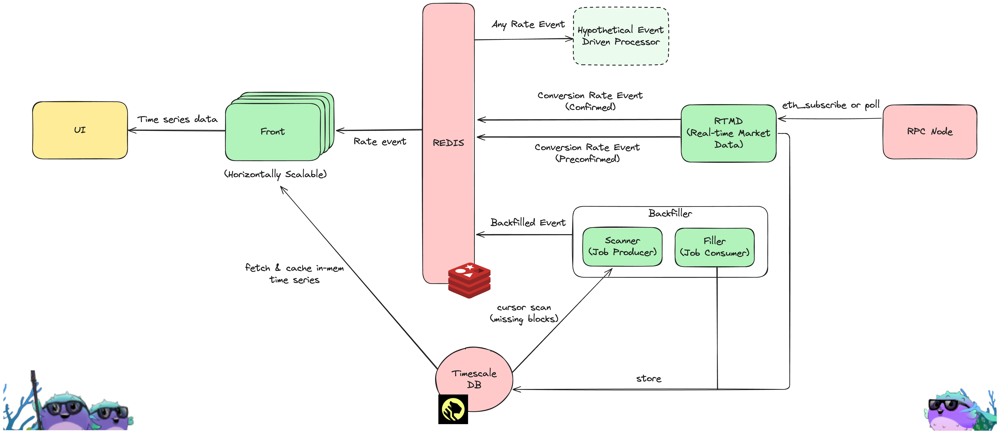

# PufETH Conversion Rate Tracker

# Tech Stack

- Timescale DB (Storage)
- Redis (Communication)
- Golang (Backend)
- NextJS (Frontend)

## Backend (Golang)

- Geth -> ETH Client calls & encoding/decoding calldata
- Chi -> Routing web requests
- Solc -> Compiling ABIs into Go bindings
- Pg -> Driver for postgresql
- sqlc -> Golang-specific generated code using SQL queries

## Frontend (Typescript NextJS)

- Rechart -> Charting library
- ReactJS -> Frontend library
- Axios -> Web requests
- Assets from Puffer Finance

# System Design

## Frontend <> Backend
